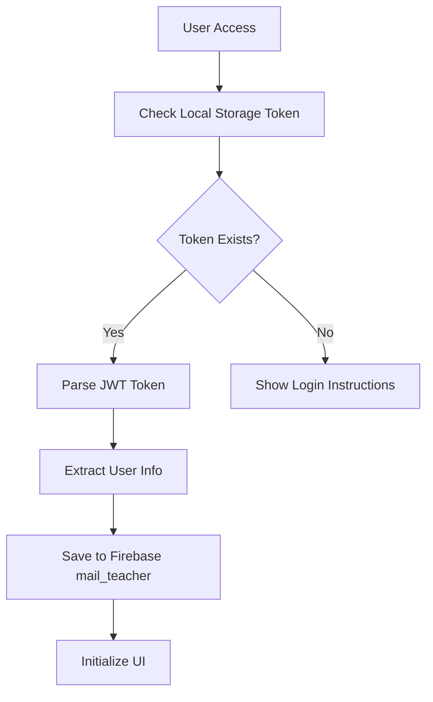
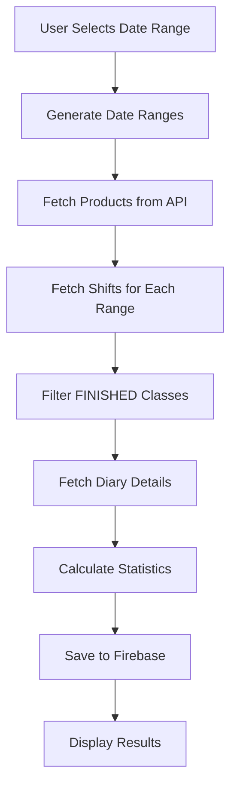
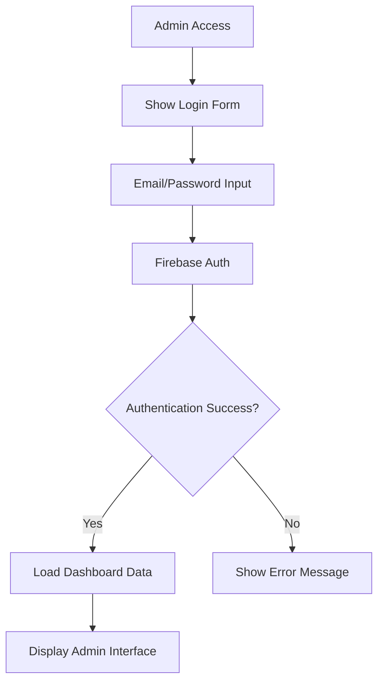
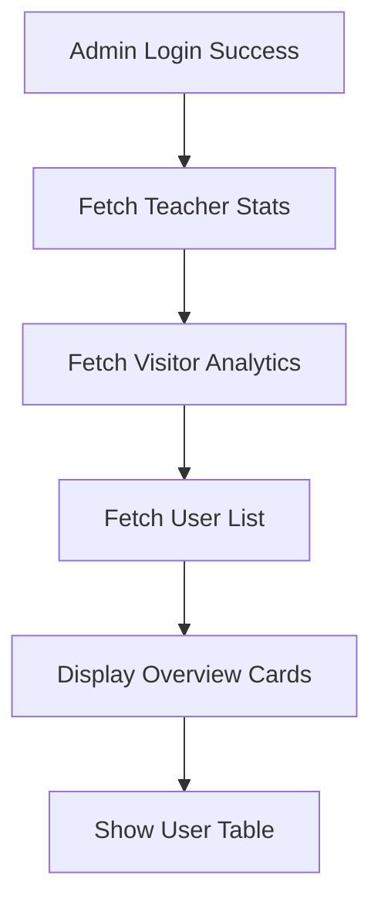
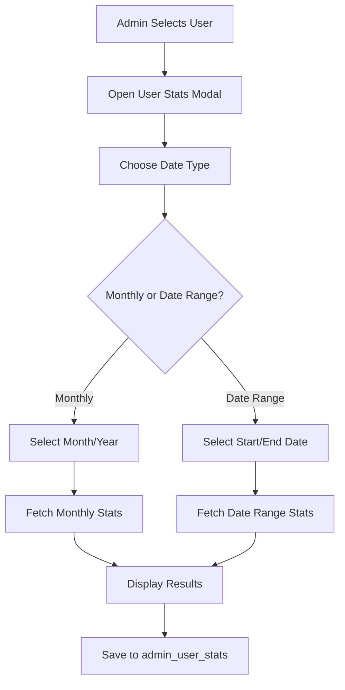
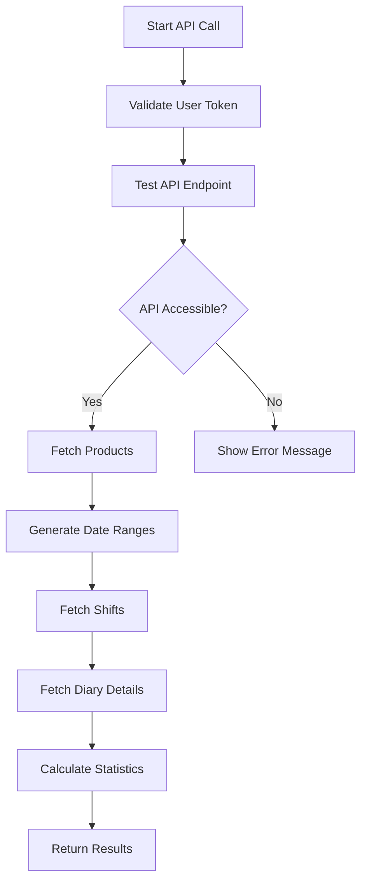

# Teacher Tracking System - Flow Xử Lý

## 📋 Tổng Quan Project

**Teacher Tracking System** là một ứng dụng web React để theo dõi và thống kê hoạt động giảng dạy của giáo viên, bao gồm:

- Thống kê theo tháng và theo khoảng thời gian tùy chỉnh
- Dashboard admin với quyền truy cập vào dữ liệu của tất cả giáo viên
- Tích hợp với Firebase để lưu trữ dữ liệu
- API integration với hệ thống teacher.ican.vn

## 🏗️ Kiến Trúc Hệ Thống

### 1. **Frontend (React)**

- **App.js**: Entry point, routing, navigation
- **TeacherStats.js**: Component chính cho giáo viên
- **AdminDashboard.js**: Component admin dashboard
- **Firebase.js**: Cấu hình Firebase

### 2. **Backend Services**

- **Firebase Firestore**: Database chính
- **Firebase Authentication**: Xác thực admin
- **External API**: teacher.ican.vn API

### 3. **Data Flow**

```
User Input → React Component → API Call → Firebase Storage → UI Display
```

## 🔄 Flow Xử Lý Chính

### **Flow 1: Teacher Statistics (TeacherStats.js)**

#### 1.1 **Khởi tạo và Authentication**



#### 1.2 **Fetch Data Process**



#### 1.3 **Date Range Generation Logic**

```javascript
// Monthly: Từ đầu tháng đến cuối tháng
generateDateRanges(year, month) {
  const startDate = new Date(Date.UTC(year, month - 1, 1));
  const endDate = new Date(Date.UTC(year, month, 0, 23, 59, 59, 999));
  // Chia thành chunks 7 ngày
}

// Custom Range: Từ ngày bắt đầu đến ngày kết thúc
generateCustomDateRanges(startDate, endDate) {
  const start = new Date(startDate);
  start.setHours(0, 0, 0, 0); // 00:00:00

  const end = new Date(endDate);
  end.setHours(23, 59, 59, 999); // 23:59:59

  // Chia thành chunks 7 ngày
}
```

#### 1.4 **Statistics Calculation**

```javascript
// Công thức tính toán
totalClasses = totalFinishedCount - totalParticipationScore;
totalMoney = totalClasses * 50000;

// Participation Score = 0.5 cho mỗi học sinh vắng
// Mỗi lớp có thể có 1-2 học sinh vắng
```

### **Flow 2: Admin Dashboard (AdminDashboard.js)**

#### 2.1 **Admin Authentication Flow**



#### 2.2 **Data Fetching Process**



#### 2.3 **User Statistics Fetching**



#### 2.4 **API Integration Flow**



## 📊 Data Structure

### **Firebase Collections**

#### 1. **mail_teacher**

```javascript
{
  email: "teacher@example.com",
  phone: "0123456789",
  token: "jwt_token_here",
  timestamp: "2025-01-20T10:00:00.000Z",
  month: 1,
  year: 2025
}
```

#### 2. **teacher_stats**

```javascript
{
  email: "teacher@example.com",
  phone: "0123456789",
  token: "jwt_token_here",
  timestamp: "2025-01-20T10:00:00.000Z",
  month: 1,
  year: 2025,
  totalFinishedCount: 20,
  totalParticipationScore: 2.5,
  totalClasses: 17.5,
  totalMoney: 875000,
  absentStudents: [...]
}
```

#### 3. **teacher_stats_date_range**

```javascript
{
  email: "teacher@example.com",
  phone: "0123456789",
  token: "jwt_token_here",
  timestamp: "2025-01-20T10:00:00.000Z",
  startDate: "2025-01-01",
  endDate: "2025-01-31",
  totalFinishedCount: 20,
  totalParticipationScore: 2.5,
  totalClasses: 17.5,
  totalMoney: 875000,
  absentStudents: [...]
}
```

#### 4. **admin_user_stats**

```javascript
{
  email: "teacher@example.com",
  phone: "0123456789",
  token: "jwt_token_here",
  timestamp: "2025-01-20T10:00:00.000Z",
  startDate: "2025-01-01", // Optional for date range
  endDate: "2025-01-31",   // Optional for date range
  month: 1,                 // Optional for monthly
  year: 2025,               // Optional for monthly
  totalFinishedCount: 20,
  totalParticipationScore: 2.5,
  totalClasses: 17.5,
  totalMoney: 875000,
  absentStudents: [...],
  requestedBy: "admin@example.com",
  requestedAt: "2025-01-20T10:00:00.000Z",
  type: "date_range" // or undefined for monthly
}
```

#### 5. **metrics/visitor_count**

```javascript
{
  total: 1234,
  updatedAt: "2025-01-20T10:00:00.000Z"
}
```

## 🔌 API Integration

### **Base URL**

```
https://api-teacher-ican.vercel.app/api/teacher/api/v1/api/teacher
```

### **Endpoints**

#### 1. **Products**

```
GET /products?page=SCHEDULE
Headers: Authorization: Bearer {token}
Response: { data: [{ id: "product_id", ... }] }
```

#### 2. **Shifts**

```
GET /shifts?status[]=ACTIVE&fromDate={ISO_DATE}&toDate={ISO_DATE}&product_ids[]={id}
Headers: Authorization: Bearer {token}
Response: { data: [{ classSessionId, className, fromDate, classStatus, ... }] }
```

#### 3. **Diary Details**

```
GET /diary/{classSessionId}
Headers: Authorization: Bearer {token}
Response: { data: { details: [{ studentName, isParticipated, ... }] } }
```

### **Date Range Processing**

```javascript
// Chia khoảng thời gian thành chunks 7 ngày
const dateRanges = [];
let currentDate = start;

while (currentDate <= end) {
  const toDate = new Date(currentDate);
  toDate.setDate(toDate.getDate() + 6);

  if (toDate > end) {
    toDate.setTime(end.getTime()); // Use end date with 23:59:59
  } else {
    toDate.setHours(23, 59, 59, 999);
  }

  dateRanges.push({
    from: currentDate.toISOString(),
    to: toDate.toISOString(),
  });

  currentDate = new Date(toDate);
  currentDate.setDate(currentDate.getDate() + 1);
  currentDate.setHours(0, 0, 0, 0);
}
```

## 🚀 Performance Optimizations

### 1. **Concurrent API Calls**

```javascript
// Sử dụng p-limit để giới hạn concurrent requests
import pLimit from "p-limit";
const limit = pLimit(5); // Tối đa 5 requests đồng thời

const diaryPromises = finishedClasses.map((classItem) =>
  limit(() => ApiService.getDiaryDetails(classItem.classSessionId))
);
```

### 2. **Date Range Chunking**

- Chia khoảng thời gian lớn thành chunks 7 ngày
- Tránh API timeout và rate limiting
- Xử lý song song các chunks

### 3. **Error Handling**

```javascript
// Graceful handling cho 404 errors
if (response.status === 404) {
  console.warn(`Diary not found for class ${index + 1}`);
  return null; // Skip this diary, continue with others
}
```

## 🔒 Security Features

### 1. **Token Validation**

```javascript
const validateToken = (token) => {
  try {
    const parts = token.split(".");
    return parts.length === 3 && parts[0] && parts[1] && parts[2];
  } catch {
    return false;
  }
};
```

### 2. **Admin Authentication**

- Firebase Authentication với email/password
- Role-based access control
- Session management

### 3. **API Security**

- Bearer token authentication
- Pre-flight API testing
- Rate limiting protection

## 📱 UI/UX Features

### 1. **Responsive Design**

- Mobile-first approach
- Tailwind CSS framework
- Dark/Light mode toggle

### 2. **Real-time Updates**

- Firebase onSnapshot listeners
- Visitor counter updates
- Live data synchronization

### 3. **User Experience**

- Loading states và progress indicators
- Error messages với suggestions
- Success confirmations

## 🧪 Testing & Debugging

### 1. **Console Logging**

```javascript
console.log("Generated date ranges:", dateRanges);
console.log("Total date ranges:", dateRanges.length);
console.log("Shifts results:", shiftsResults);
```

### 2. **Error Tracking**

- Network error handling
- API response validation
- User-friendly error messages

### 3. **Data Validation**

- Date range validation
- Token format checking
- API response format verification

## 🔄 State Management

### **TeacherStats State**

```javascript
const [loading, setLoading] = useState(false);
const [stats, setStats] = useState({...});
const [selectedMonth, setSelectedMonth] = useState(new Date().getMonth() + 1);
const [selectedYear, setSelectedYear] = useState(new Date().getFullYear());
const [activeTab, setActiveTab] = useState("month");
const [customStartDate, setCustomStartDate] = useState(today);
const [customEndDate, setCustomEndDate] = useState(today);
```

### **AdminDashboard State**

```javascript
const [user, setUser] = useState(null);
const [dashboardData, setDashboardData] = useState({...});
const [activeTab, setActiveTab] = useState("users");
const [userList, setUserList] = useState([]);
const [selectedUserForDetails, setSelectedUserForDetails] = useState(null);
const [useDateRange, setUseDateRange] = useState(false);
const [startDate, setStartDate] = useState("");
const [endDate, setEndDate] = useState("");
```

## 📈 Future Enhancements

### 1. **Performance Improvements**

- Implement caching layer
- Add data pagination
- Optimize API calls

### 2. **Feature Additions**

- Export data to Excel/PDF
- Advanced filtering options
- Real-time notifications

### 3. **Scalability**

- Microservices architecture
- Database optimization
- CDN integration

---

**Version**: 1.0  
**Last Updated**: January 2025  
**Maintainer**: Châu Đỗ  
**Documentation**: This document describes the complete flow and architecture of the Teacher Tracking System
